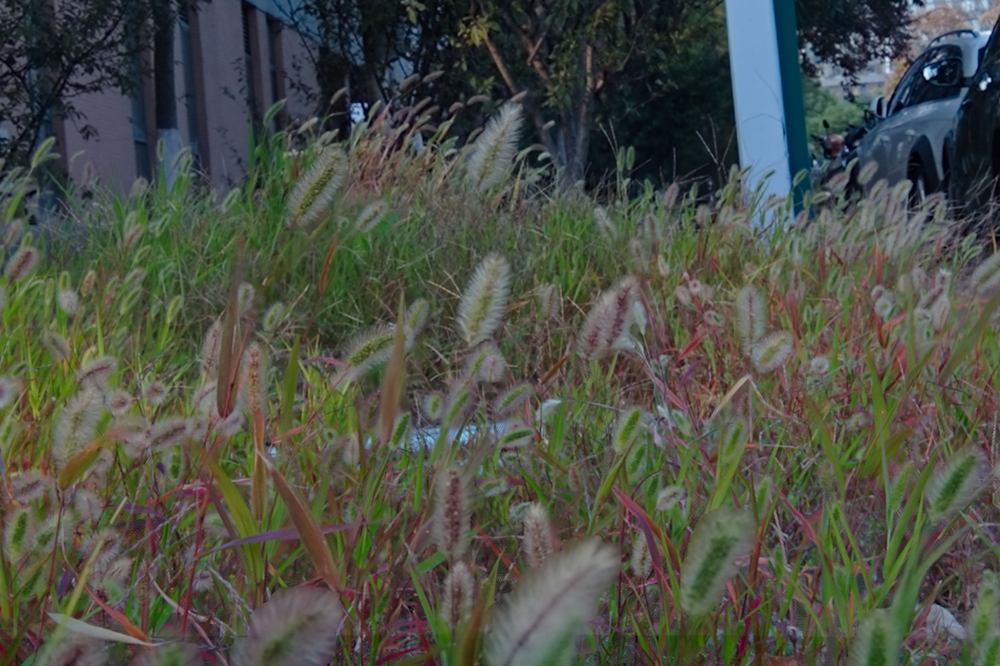
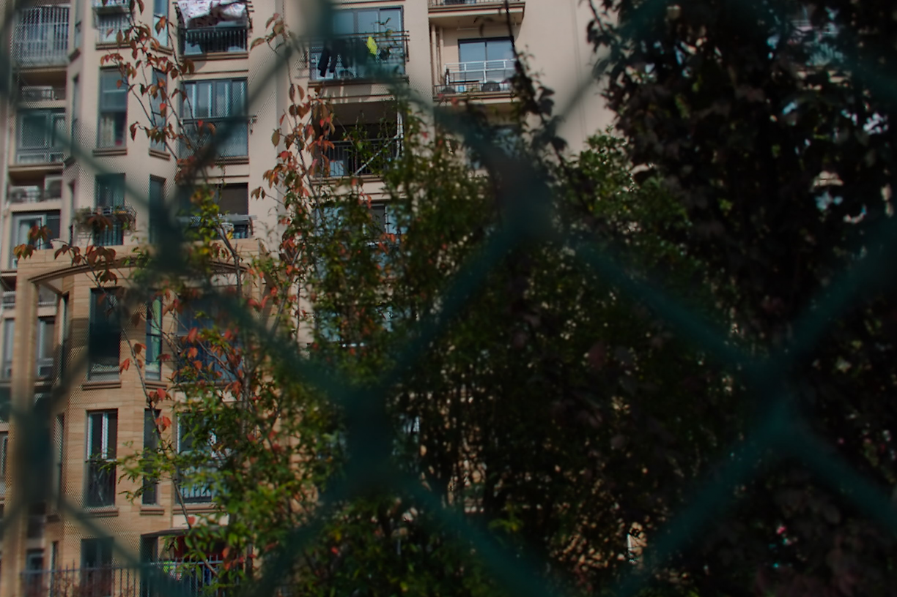
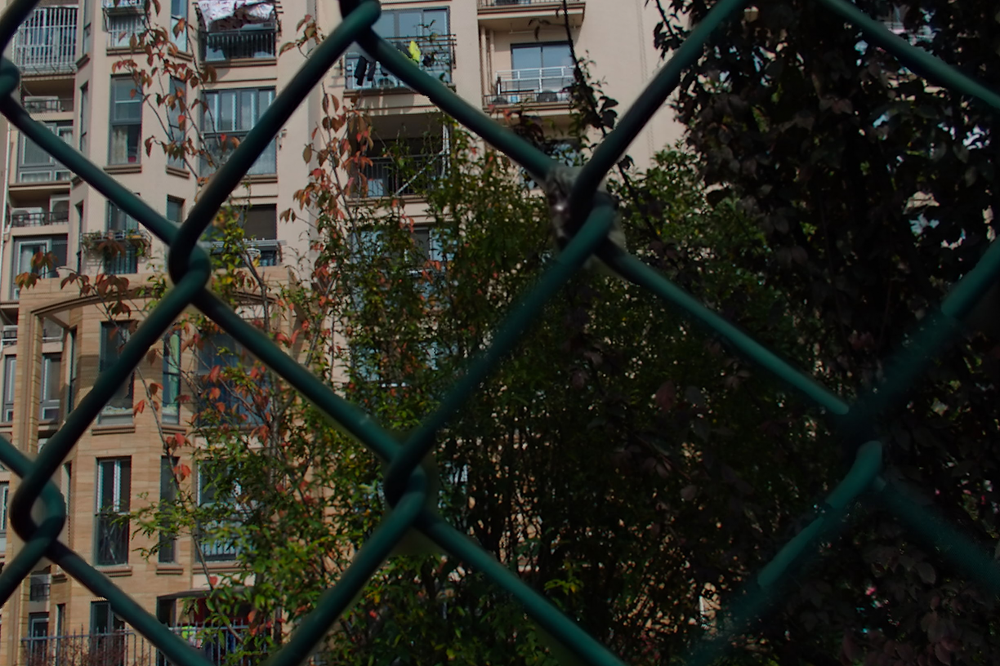
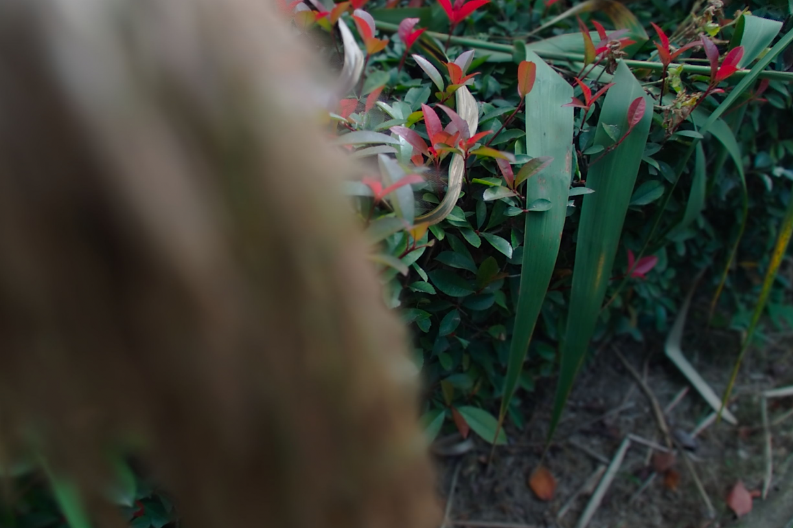
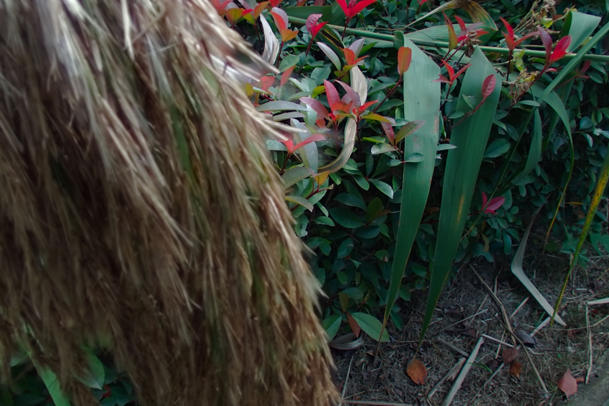

# Joint-Upsampling-for-Refocusing-Light-Field-in-a-Hybrid-Imaging-System

The official implementation of paper "Joint Upsampling for Refocusing Light Field in a Hybrid Imaging System"

## Environment introduction

### Hardware

```command
CPU: Intel(R) Core(TM) i7-8700K
GPU: GTX 1080
RAM: 8G*2 2666
```

### Python

```command
torchvision==0.7.0+cu101
torch==1.6.0+cu101
opencv_python==4.4.0.46
numpy==1.18.5
scikit_image==0.18.1
Pillow==8.1.1
skimage==0.0
```

## Dataset

The raw Lytro Dataset can be downloaded from Google Drive. You can use Lytro Desktop to refocus the raw lytro photos.
Our dataset contains scenes with thin structures and rich textures (see below), which are difficult for refocused image upsampling. 

<table>
    <tr>
        <td><center>Input (GT) in Training Dataset</center></td>
        <td><center>Guidance (GT) in Training Dataset</center></td>
    </tr>
</table>

<table>
    <tr>
        <td><center>Input (GT) in Testing Dataset </center></td>
        <td><center>Guidance (GT) in Testing Dataset </center></td>
    </tr>
</table>

<table>
    <tr>
        <td><center>Input (GT) in Additional Dataset </center></td>
        <td><center>Guidance (GT) in Additional Dataset </center></td>
    </tr>
</table>

[Baidu](https://pan.baidu.com/s/1Ap6fUxGO0OcIXTmDjPmOWg?pwd=4ca5), code: 4ca5
[Google](https://drive.google.com/file/d/1z6ZD4L3Sx6vaOLbGg6yE3HWALYhjt7zp/view?usp=sharing)

raw Lytro Dataset can be downloaded in [Google Drive](https://drive.google.com/file/d/1PipWdDykFnSknF-7KkjcL8IRZKWMSGr6/view?usp=sharing), note that additional lytro photos are taken, and you can use Lytro Desktop to decode the raw lytro photos.

## Model

The pretrained model is already uploaded in repo, `./Model/LFN.pth`

## Training

Customize the `trainConfig` in `train.py` and run it

```python
python train.py
```

## Testing

Customize the `evalPngConfig` in `test.py` and run it

```python
python test.py
```

In `test.py`, you can use `testAllInOne` to test x2/x4/x8 for both shallow & deep testing dataset at one time. Or use `evalPng` to test the selected scale.

## Other

If you have any question, please leave an issue.
